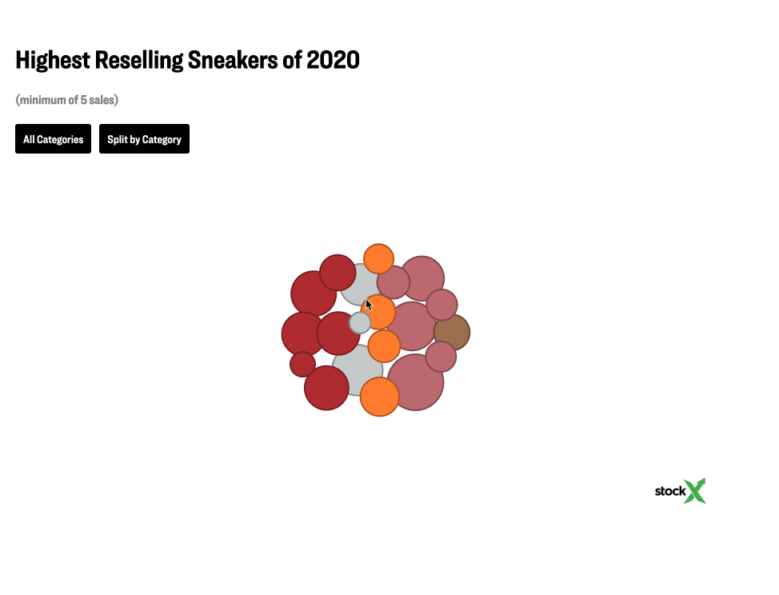

# StockX Dataviz
These are all of my visualizations for [my writing at StockX](https://stockx.com/news/author/justin-gage/). It's all done (very poorly) in D3.js, with the data pulled from StockX and hosted as CSV files in Gists. 

This visualization code features your favorite cast of oh-so hateable characters that remind you why you love Javascript so much:

- [Magic numbers](https://en.wikipedia.org/wiki/Magic_number_(programming)) everywhere
- No cross browser testing at all
- Interactivity and positioning completely dependent on window width and height
- Incorrect, indiscriminate, and frankly irresponsible usage of `var` instead of `const`

This is why I'm not a full time engineer. But at least it looks good!

Use to your heart's content under the [MIT License](https://opensource.org/licenses/MIT).
